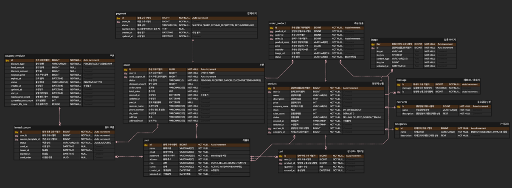
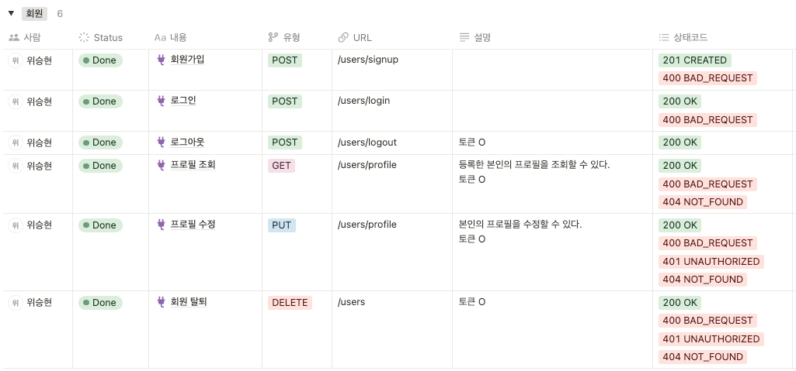
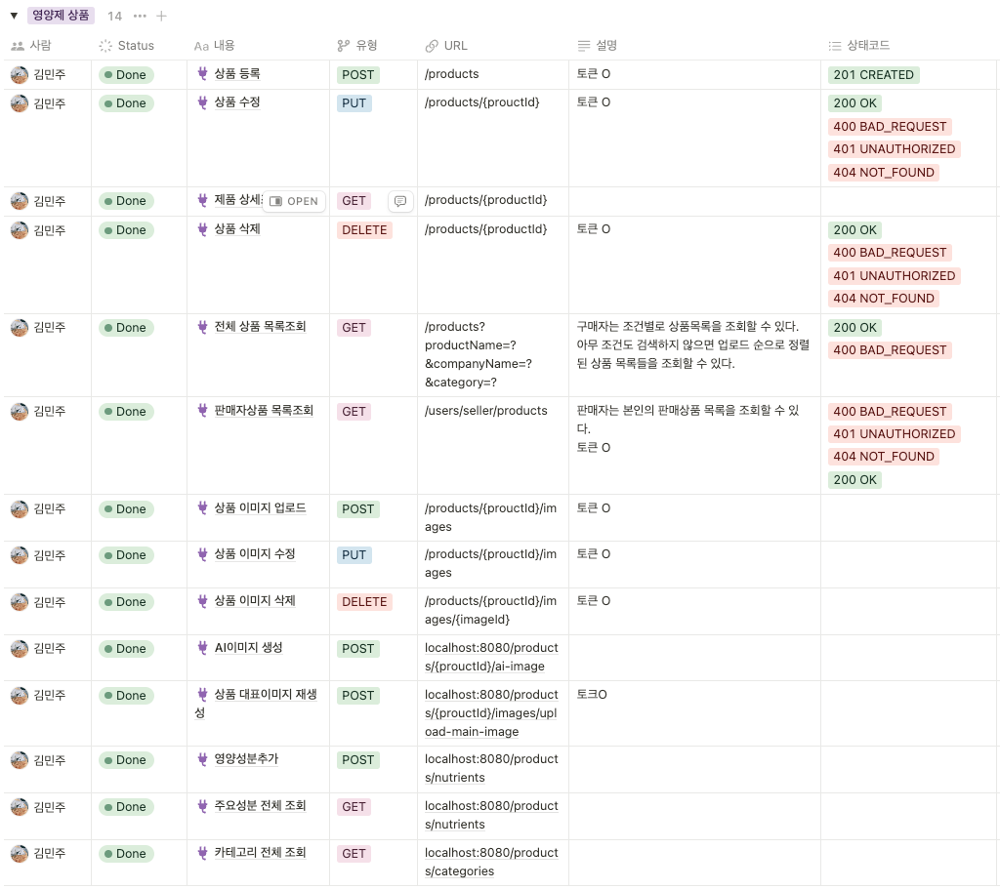
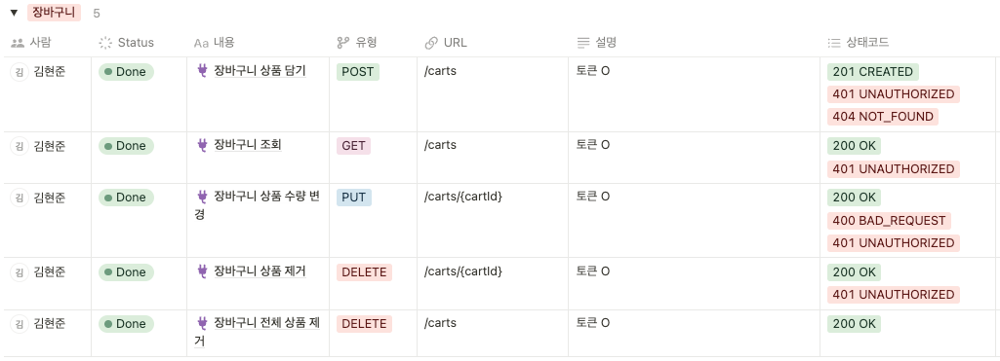
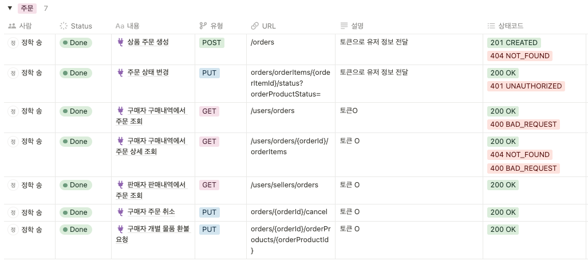
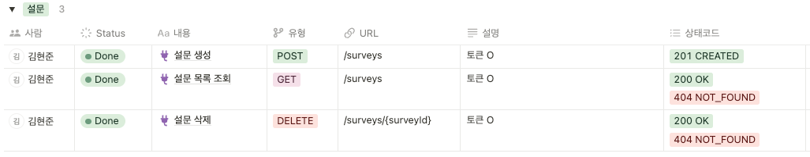
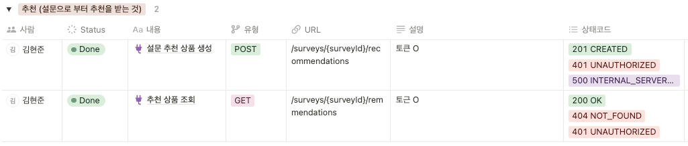
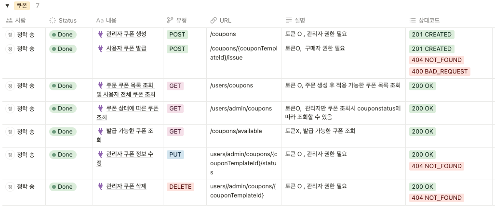
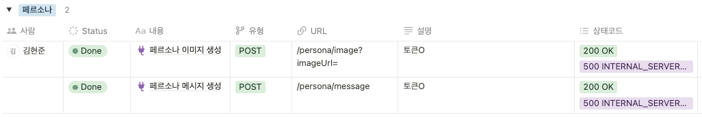

# 💊 pillyohae

---

## 👨‍💻 About Project

### 사용자의  건강 상태와 생활 패턴을 분석해 꼭 맞는 영양제를 추천해주는 영양제 이커머스

- 사용자 설문 기반 영양제 추천 서비스
- 영양제 판매 및 구매
- 상품 구매 유도를 위한 상품 관련 AI 메세지 자동생성
- 상품 이미지 업로드 시 상품이미지 기반 AI 이미지 제공
- 관리자 권한으로 쿠폰 발행을 발행하여 제품 할인 서비스 제공 가능

---

## 🛠️ Tools

 
  
 
 
 

 
 
 

 

---

## ‍👨‍💻 인프라 설계도

---

## 👨‍💻 Period : 2025/01/02 ~ 2025/02/11

---

## 👨‍💻 Pill요해? 팀원소개

| 위승현                                                             | 송정학                                        | 김현준                                | 김민주                                                   |
|-----------------------------------------------------------------|--------------------------------------------|------------------------------------|-------------------------------------------------------|
| [@Weseunghyun](https://github.com/Weseunghyun?tab=repositories) | [@sjhak8034](https://github.com/sjhak8034) | [@fl4kx](https://github.com/fl4kx) | [@kmj-23](https://github.com/kmj-23?tab=repositories) |

---

## 👨‍💻 ERD

---

## 👨‍💻 API명세서

회원

상품

장바구니

주문

설문

추천

쿠폰

페르소나(AI 이미지/메세지)

---

## ‍👨‍💻 와이어 프레임

### [필요해 와이어프레임 바로가기](https://www.figma.com/design/HrSfEtAO1Mgo6suY8qRCBI/Pill%EC%9A%94%ED%95%B4%3F?node-id=0-1)

---

